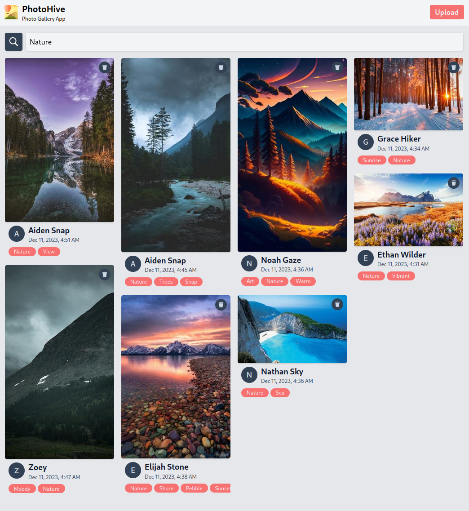

# PhotoHive

PhotoHive is a photo gallery app that allows users to upload, search, and manage photos. This project utilizes React for the frontend, Flask for the backend, and AWS services such as Lambda, DynamoDB, and S3 for serverless deployment.

## Features

- Upload and manage photos with user-friendly interfaces.
- Search photos by username or topic.
- Add multiple topics to a single photo.
- Recover deleted photos through a request system.
- Responsive UI for seamless user experience.
- Optimized backend for enhanced performance.

## Deployment

### Backend Deployment (AWS Lambda with Flask)

For deploying the backend, the Serverless Framework is utilized. The Flask app interacts with AWS S3 for image storage and DynamoDB for managing photo metadata.

### Frontend Deployment (React, TailwindCSS, and Vite)

The frontend, built with React, TailwindCSS, and Vite, is deployed on an S3 bucket. The deployment script syncs the build with the bucket and configures S3 for static website hosting.

## Screenshots

## Installation

To run this project locally, follow these steps:

1. Clone the repository.
2. Set up the backend by deploying the Flask app on AWS Lambda.
3. Set up the frontend by deploying the React app on an S3 bucket.

## Usage

1. Visit the provided website link.
2. Upload, search, and manage photos using the user-friendly interface.
3. Explore additional features such as topic tagging and photo recovery.

## License

This project is licensed under the [MIT License](LICENSE).

